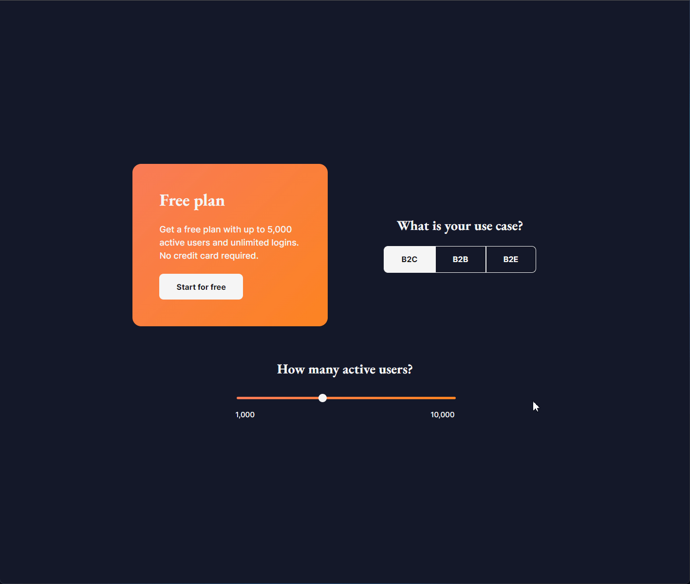

## Pricing Components

This project is a study case based in one of the challenges provided on [iCodeThis](https://icodethis.com). The proposal it was to create 3 components that is related to banking/ecommerce websites. This version was built using my personal [SCSS library](https://github.com/feliperdamaceno/sass-starter-library), along with React + Typescript.

## Licence

This is an open-source project and is available under the [**MIT License**](LICENSE). You are free to use, modify, and distribute the code in accordance with the terms of the license.

## Contributors

Contributions are highly appreciated! If you encounter any issues or have suggestions for improvements, please feel free to open an issue or submit a pull request.

[feliperdamaceno](https://github.com/feliperdamaceno)

## Contact me

Linkedin: [feliperdamaceno](https://www.linkedin.com/in/feliperdamaceno)
